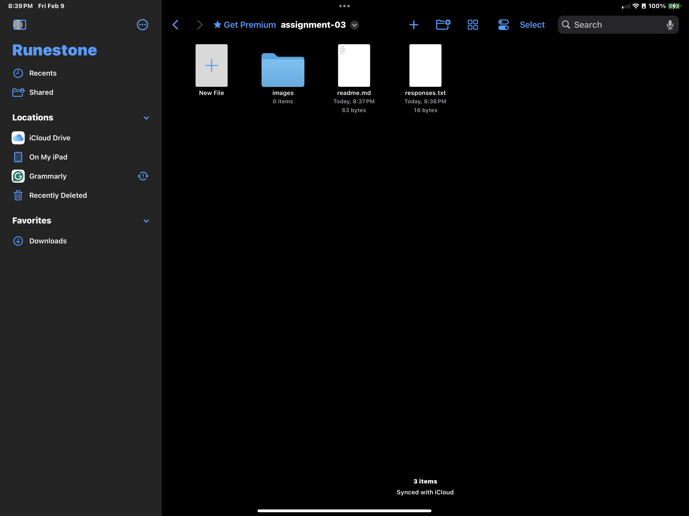

# Heading 

## Heading 2

### Heading 3 

**testing**

*test*

I am slowly trying to piece everything together. I work from an ipad as of now, and trying to find applications that transfer over have been proving to be more of a challenge than I thought. I think I am figuring it out, but this application I am using won't let me preview the work so I am unsure and was hoping GitHub would be able to provide that preview. If you had any advice towards where to look, that would be greatly appreciated. However, I am enjoying the challenge and the process in general, so I will probably be looking to purchase a laptop, I just can't do it yet. 

[Click Here](https://www.popsci.com/category/weirdest-thing-i-learned-this-week/)

[My File](./responses.txt)

